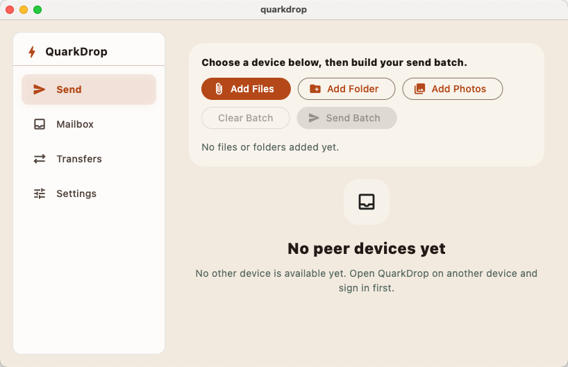
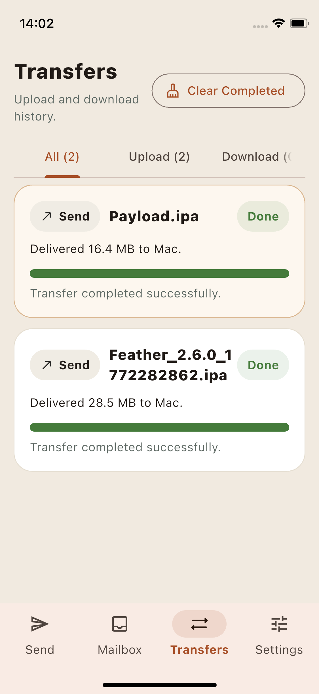

# QuarkDrop

[English](./README.md) | 简体中文

---

QuarkDrop 是一款基于**夸克网盘**的跨平台加密中继文件传输应用。  
文件在上传前完成端对端加密，作为临时中继包存储于网盘。  
接收方设备下载并解密文件包后，云端副本会自动清除。

无需自建服务器——夸克网盘仅作为中继媒介。

## 功能特性

- **发送文件与文件夹** 至同账号下的任意其他设备
- **收件箱** — 接收对端设备发来的中继包，或直接拒绝（删除云端文件）
- **传输历史** — 逐任务显示进度、大小、阶段，失败任务一键恢复
- **自动接收** — 自动将收到的文件下载到指定目录
- **端对端加密** — 每分块使用 AES-GCM 加密；云端只存储密文
- **云密码** — 设备密钥使用用户自设的密码加密保护
- **多平台支持** — Android · iOS · Windows · macOS · Linux
- **后台传输** — 文件加入队列后在后台持续传输
- **可配置并发数** — 自定义同时上传/下载的文件数量
- **开机自启**（桌面端）

## 平台支持

| Android | iOS | Windows | macOS | Linux |
|:-------:|:---:|:-------:|:-----:|:-----:|
|   ✔     |  ✔  |    ✔    |   ✔   |   ✔   |

## 快速开始

1. 在至少两台设备上安装 QuarkDrop。
2. 两台设备均使用同一个夸克账号登录。
3. 在第一台设备上设置云密码，第二台设备登录时将被要求验证。
4. 两台设备在各自的**发送**界面中互相可见。
5. 选择文件或文件夹，选中目标设备，点击**发送批次**。

## 截图

## 技术架构

### 原理

- 每台设备在夸克网盘中拥有一个私有邮箱文件夹。
- 发送时，加密后的中继包被上传到接收方设备的邮箱文件夹中。
- 接收方轮询新文件包，自动下载（或从**收件箱**手动下载）。
- 成功接收后，云端中继包自动删除。
- 文件内容使用随机生成的传输密钥进行 AES-GCM 加密，密钥本身再使用接收方设备公钥加密。

### 技术栈

应用采用前后端分离架构：

- **Flutter** 负责 UI 渲染与页面导航。
- **Rust**（通过 `flutter_rust_bridge`）负责所有 I/O、加密和云 API 交互。
- Dart 与 Rust 均为跨平台语言，支持 Android / iOS / Windows / macOS / Linux。

## 本地存储

| 平台 | 配置 / 任务 JSON | 默认下载目录 |
|------|-----------------|------------|
| iOS | `Application Support/quarkdrop` | `Documents` |
| Android | `filesDir/quarkdrop` | 每次由用户选择 |
| 桌面端 | 平台应用支持/配置目录 | 用户选择（或在设置中配置） |

当前路径可在**设置 → 打开数据文件夹**（调试版本）中查看。

## 许可证

GPL-3.0-only
